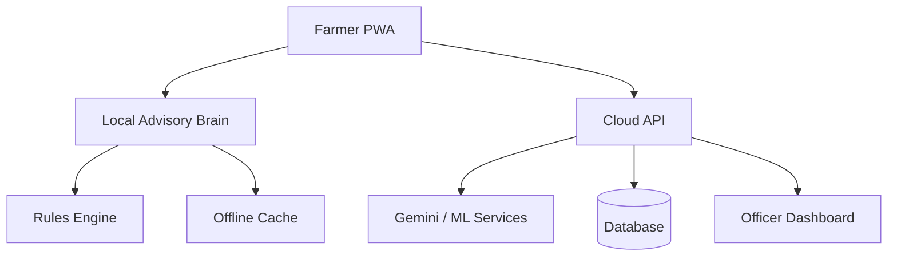

# Agri Architect — Backend, DB, IoT Pipelines & Offline Sync

## Purpose

Design the technical backbone for agritech systems: APIs, databases, rule engines, sync, deployments, edge gateways and official dashboards.

## Architecture patterns

### Two-brain farmer system



### API categories

- `/health` — lightweight wake and readiness route
- `/get-advisory` — weather + crop + stage risk scoring
- `/scan` — image diagnosis via Gemini or other vision model
- `/telemetry` — sensor readings from edge devices
- `/alerts` — normalized crop/weather/pest warnings
- `/confirmations` — farmer or expert validation feedback

## Recommended database collections/tables

### `farmers`

```json
{
  "id": "string",
  "phone": "string",
  "name": "string",
  "language": "en|hi|bn|mr",
  "village": "string",
  "createdAt": "timestamp"
}
```

### `farms`

```json
{
  "id": "string",
  "farmerId": "string",
  "crop": "paddy|potato|cotton|other",
  "variety": "string",
  "sowingDate": "date",
  "area": 1.0,
  "areaUnit": "acre",
  "soil": "loamy|clay|black|red|sandy",
  "irrigation": "drip|sprinkler|flood|rainfed",
  "lat": 22.57,
  "lng": 88.36
}
```

### `advisories`

```json
{
  "id": "string",
  "farmId": "string",
  "generatedAt": "timestamp",
  "weatherSource": "open-meteo|demo|sensor",
  "alerts": [],
  "irrigation": {},
  "market": {},
  "shared": false
}
```

### `scan_results`

```json
{
  "id": "string",
  "farmId": "string",
  "crop": "paddy",
  "disease": "sheath blight",
  "severity": "low|medium|high",
  "confidence": 82,
  "source": "gemini|tflite|expert",
  "expertValidated": false,
  "createdAt": "timestamp"
}
```

### `telemetry_readings`

```json
{
  "deviceId": "edge-001",
  "farmId": "farm-001",
  "timestamp": "timestamp",
  "soilMoisture": 31,
  "soilTemperature": 27.4,
  "airTemperature": 32.1,
  "humidity": 78,
  "battery": 86
}
```

## Offline sync strategy

1. Compute advisory locally.
2. Save to local storage/IndexedDB.
3. Render UI immediately.
4. Sync to backend in the background.
5. If sync fails, queue for retry.
6. Merge server response only if it improves confidence or adds validated data.

## API design rules

- All endpoints must return structured JSON.
- Error messages should be demo-safe and user-safe.
- `/health` must not call expensive APIs.
- Image scan failures should return codes the frontend can translate into fallback UI.
- Backend persistence must be optional for demo resilience.

## Deliverables

- architecture diagram,
- endpoint contracts,
- schema file,
- offline sync notes,
- deployment plan,
- failure-mode matrix.

