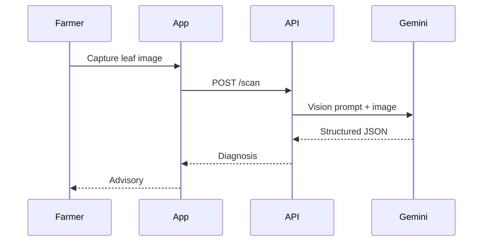
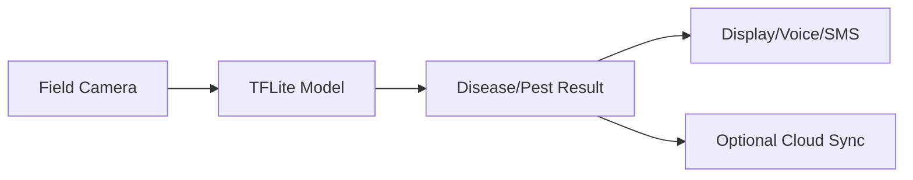

# Crop Vision — Edge ML + Cloud Multimodal AI

## Purpose

Design and implement crop image diagnosis using cloud multimodal AI, edge ML and fallback symptom logic.

## Supported patterns

### Cloud vision flow



### Edge vision flow



## Gemini scan contract

Return JSON only:

```json
{
  "isLeaf": true,
  "crop": "paddy|potato|cotton|other",
  "disease": "name",
  "severity": "low|medium|high",
  "confidence": 0,
  "summary": "short farmer-safe explanation",
  "causes": [],
  "treatment": [],
  "prevention": []
}
```

## Model safety rules

- Reject non-leaf images.
- Never claim certainty when confidence is low.
- Recommend expert/lab referral for severe or unclear cases.
- Avoid unsafe pesticide dosage unless validated by official guidance.
- Always provide non-chemical IPM steps where possible.

## Edge ML options

- YOLO for pest detection or pest-trap insect counting.
- MobileNet/EfficientNet/TFLite for leaf disease classification.
- Quantized models for Raspberry Pi/ESP32-class edge setups.
- Confidence thresholding with “uncertain” state.

## Fallback design

If cloud AI fails due to quota, network or key issues:

1. Show graceful message.
2. Offer offline symptom checker.
3. Preserve the image locally only if user consents.
4. Encourage retake or expert validation.

## Evaluation metrics

- precision/recall per disease class,
- false-positive rate,
- confidence calibration,
- latency on target device,
- offline fallback completion rate,
- expert validation agreement.

