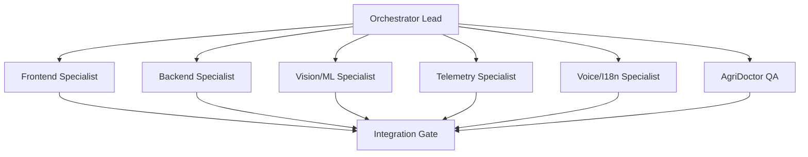

# Swarm Coding — Hierarchical Parallel Development Framework

## Purpose

Coordinate multi-agent development so teams can build frontend, backend, ML, IoT, docs and tests in parallel without breaking interfaces.

## Swarm hierarchy



## Parallelization rules

- Split by stable interfaces, not by vague feature names.
- Freeze API contracts before parallel work starts.
- Each specialist gets files, constraints and tests.
- No specialist performs unrelated refactors.
- The lead merges only after validation.

## Task decomposition template

```text
Epic:
Interface Contract:
Parallel Tasks:
  1. Frontend:
  2. Backend:
  3. Data/ML:
  4. Tests:
  5. Docs:
Merge Order:
Rollback Plan:
Demo Validation:
```

## Example: Add pest-trap module

```text
Frontend: Pest trap screen + image/card UI
Backend: POST /pest-trap, GET /pest-trap/history
Telemetry: MQTT topic farm/{farmId}/trap
Vision: insect count model contract
QA: fixture tests + offline fallback
Docs: update README and demo script
```

## Integration gate

Before merging:

- lint passes,
- build passes,
- API returns expected JSON,
- offline fallback works,
- mobile screen is usable,
- demo script is updated.

