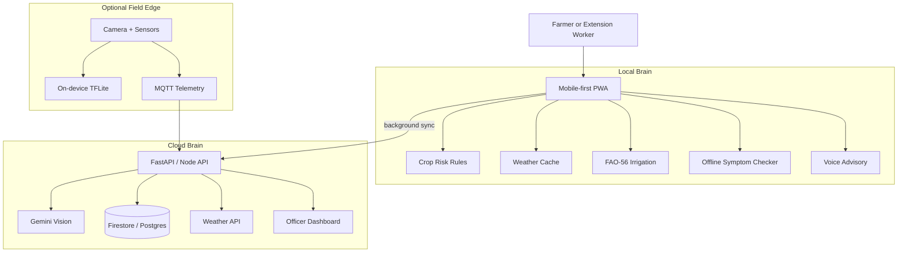

# 🛡️ AgriShield Starter Kit + Kisan Nyay

> This branch includes **Kisan Nyay**, an offline-first crop-loss evidence application with an AWS SAM serverless backend. Start with [`frontend/README.md`](frontend/README.md), [`docs/AWS_ARCHITECTURE.md`](docs/AWS_ARCHITECTURE.md), and [`docs/AWS_DEPLOYMENT.md`](docs/AWS_DEPLOYMENT.md).


A reusable **AgriTech / Full-Stack Agentic Development Framework** extracted from the award-winning **AgriShield 365** project by **Team RAVEN ROOTS**.

This starter kit is designed for SIH-style hackathons, agritech prototypes, rural innovation products, and production-grade farmer advisory platforms. It gives your team a structured agent workflow for building systems that combine:

- farmer-first product design,
- multilingual advisory UX,
- offline-first mobile/web apps,
- crop disease and pest risk engines,
- Gemini-powered multimodal crop diagnosis,
- IoT and edge-AI telemetry,
- irrigation science,
- mandi and market intelligence,
- extension-worker dashboards,
- CI/CD quality checks.

---

## 1. What this repository is

`agrishield-starter-kit` is not just a folder of prompts. It is a reusable engineering operating system for high-speed agritech development.

It defines eight specialist skills:

| Skill | Role |
| --- | --- |
| `agri-orchestrator` | Master router, intent classifier, task planner and handoff controller |
| `agri-architect` | Backend, database schemas, API contracts, offline-first sync and deployment architecture |
| `agri-design` | SIH requirement probing, `/grill-me`, PRD writing and evaluation-readiness |
| `swarm-coding` | Multi-agent development decomposition, parallel task allocation and integration protocol |
| `crop-vision` | Gemini Vision, YOLO/TFLite, image diagnosis, validation and fallback design |
| `telemetry-stream` | IoT sensor ingestion, MQTT payloads, thresholds, alert triggers and field-device protocols |
| `voice-advisory` | Vernacular voice, text-to-speech, speech input and farmer-friendly advisory writing |
| `agridoctor` | Linting, testing, mutation testing, security review, deployment checks and release gates |

The framework is based on lessons from AgriShield 365:

- never let a sleeping cloud API block the farmer,
- compute core advisories locally first,
- make AI useful but not mandatory,
- keep the UI multilingual and explainable,
- treat weather, crop stage, soil, irrigation and pest risk as one decision graph,
- build demos that still survive quota errors, weak networks and judging-room surprises.

---

## 2. Quick start

From the parent directory:

```bash
chmod +x agrishield-starter-kit/check_env.sh agrishield-starter-kit/setup_starter_kit.sh
./agrishield-starter-kit/check_env.sh
./agrishield-starter-kit/setup_starter_kit.sh my-agritech-project
cd my-agritech-project
```

This creates a new agent-ready agritech project scaffold with the `.agents/skills` layout, reusable persona files, a project README, and starter directories for frontend, backend, edge and docs.

---

## 3. Recommended workflow

### Step 1 — Start with `agri-design`

Use `/grill-me` before building. The design agent should ask hard SIH-style questions:

- Who is the exact user: farmer, FPO, extension officer, agriculture department, cooperative, enterprise estate?
- Which crop, region and season are in scope?
- What is the disease/pest/disaster problem?
- What must work offline?
- What data is real, simulated or future-roadmap?
- What is the judging demo path?
- What evidence supports the claimed impact?

Output: `docs/PRD.md`, `docs/DEMO_SCRIPT.md`, `docs/EVALUATION_MATRIX.md`.

### Step 2 — Route through `agri-orchestrator`

The orchestrator converts the PRD into tasks and assigns them to specialists.

Example routing:

```text
User: Add pest-trap telemetry and a dashboard.
Orchestrator:
  - agri-architect: database schema + API endpoints
  - telemetry-stream: MQTT topic and alert thresholds
  - swarm-coding: implementation plan
  - agridoctor: tests and release gate
```

### Step 3 — Build in swarms

Use `swarm-coding` to split work into independent branches or modules:

- frontend screen,
- backend endpoint,
- rule-engine test,
- IoT simulator,
- documentation,
- deployment config.

### Step 4 — Validate with `agridoctor`

Before demo or push:

```bash
npm run lint
npm run build
python -m pytest
curl /health
curl /scan/health
```

`agridoctor` also checks whether the app still works if:

- AI quota is exhausted,
- Render/free backend is asleep,
- weather API fails,
- Firebase SMS is not available,
- network is offline.

---

## 4. Reference architecture



---

## 5. AgriShield design principles

1. **Farmer first, not dashboard first.** Start with what the farmer sees, hears and acts on.
2. **Local-first.** The phone should provide core advice even when cloud services fail.
3. **AI as an upgrade, not a dependency.** Gemini Vision enhances crop diagnosis; offline symptom logic remains available.
4. **Explain every alert.** No black-box warning should appear without “why this alert?” reasoning.
5. **Regional scope beats generic agriculture.** Crop, season, language and local risk history matter.
6. **Use science, but speak simply.** FAO-56, ICAR and weather thresholds should become farmer-friendly actions.
7. **Demo resilience is a feature.** A quota error or cold start should become a strength in the story, not a collapse.
8. **Separate current build from roadmap.** Judges respect honesty. Label sensor, satellite and official-dashboard modules correctly.

---

## 6. Skill invocation cheat sheet

| Need | Use |
| --- | --- |
| “I have a broad idea; turn it into a build plan.” | `agri-orchestrator` |
| “Design the database/API/offline sync.” | `agri-architect` |
| “Ask me hard SIH questions and write PRD.” | `agri-design` |
| “Split this into parallel agent tasks.” | `swarm-coding` |
| “Add crop image AI or TFLite disease model.” | `crop-vision` |
| “Add field sensors, MQTT or alerts.” | `telemetry-stream` |
| “Make advisories farmer-friendly in languages.” | `voice-advisory` |
| “Check quality before demo/deploy.” | `agridoctor` |

---

## 7. Starter project outputs

A generated project should normally contain:

```text
my-agritech-project/
├── .agents/skills/          # copied skills
├── assets/agents/           # reusable personas
├── frontend/                # React / Next / PWA app
├── backend/                 # FastAPI / Node API
├── edge/                    # device simulator, TFLite, MQTT clients
├── docs/                    # PRD, architecture, demo script, report
├── tests/                   # shared tests and fixtures
├── check_env.sh
└── README.md
```

---

## 8. SIH-ready acceptance checklist

Use this checklist before submission:

- [ ] Problem statement and organization are stated exactly.
- [ ] User persona is specific.
- [ ] At least one live demo path works end-to-end.
- [ ] App has a no-internet fallback path.
- [ ] AI failure mode is graceful.
- [ ] Data sources are cited.
- [ ] Business model is aligned to software/hardware category.
- [ ] Architecture diagram is explainable in 60 seconds.
- [ ] README has setup, API, demo and roadmap.
- [ ] Judges can open the app from a QR code.
- [ ] `/health` route wakes backend before demo.
- [ ] The final pitch says what is built now vs what is future roadmap.

---

## 9. License

MIT-style reuse is recommended for hackathon starter projects. Verify your institution or competition rules before publishing private datasets, API keys or judge-only documents.
